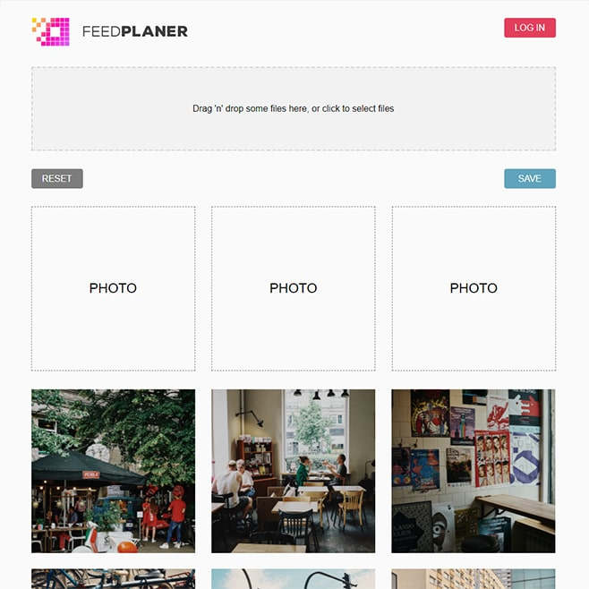

# Feed Planer – web application 
web application dedicated for planning instagram feed. It’s a graduation project 

## Table of contents
* [Screenshots](#screenshots)
* [Technologies](#technologies)
* [Setup](#setup)
* [Features](#features)
* [Status](#status)

## Screenshots

## Technologies
* React JS - version 17.0.1
* CSS3
* Firebase DB - version 7.24.0

## Setup
feedplaner.sot-dev.com

## Features
* Upload images and create a grid using drag and drop
* Save the images in the same order as you did

To-do list:
* Login in to your Instagram to load existing grid. (Freezed. Can’t get accesses to Instagram API)

## Status
Project is: _in progress_. Maybe someday I will get access to Instagram API.
